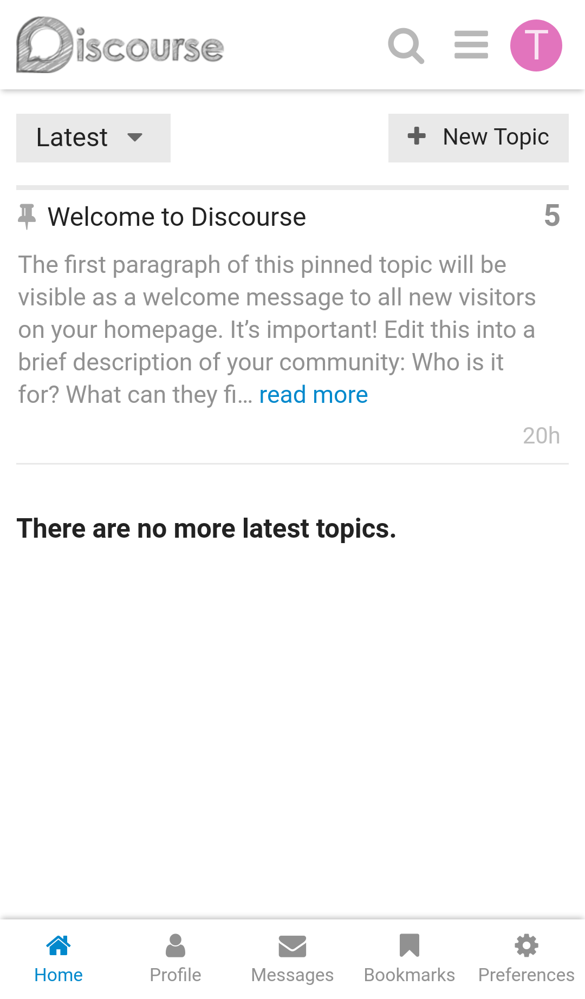
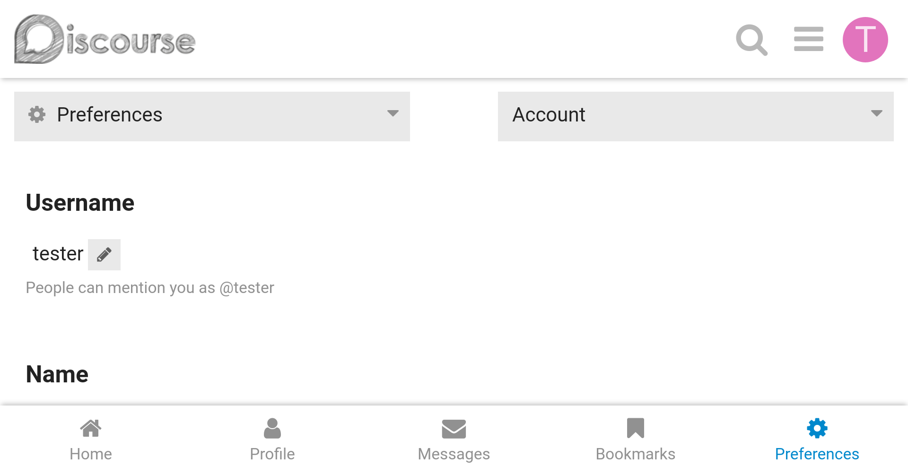
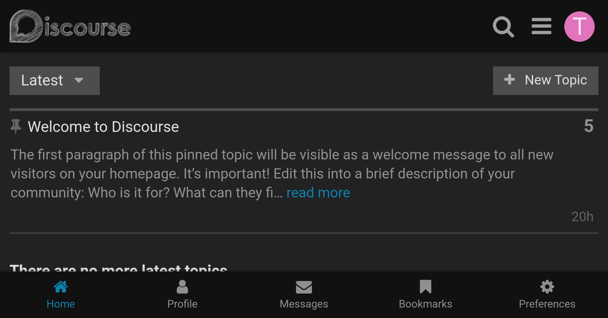
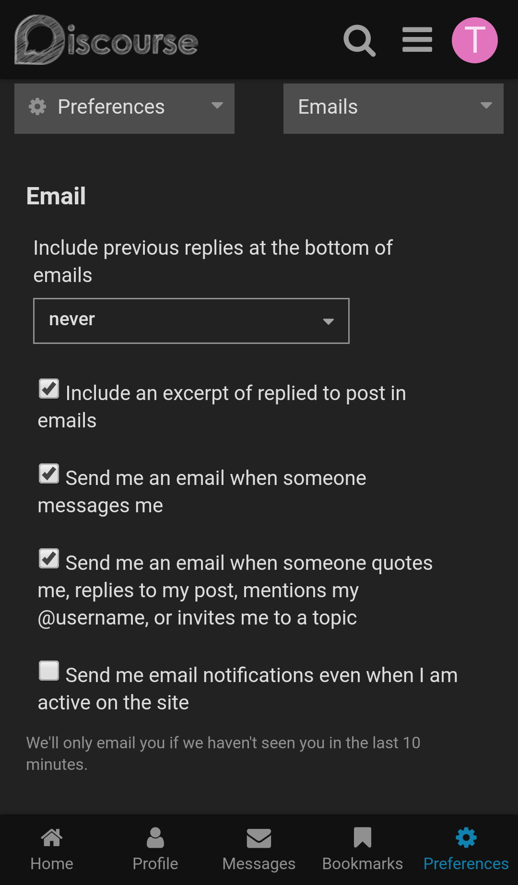

# discourse-tab-bar-theme

This theme adds a tab bar to your Discourse forums to let your users on mobile quickly navigate to other pages on the forums.

The tab bar will **only** show to **logged-in** users on **mobile** devices.

This theme comes with 6 tabs. 5 of them are enabled out of the box.

Tabs are:

1. Homepage (enabled)
2. Profile (enabled)
3. Messages (enabled)
4. Bookmarks (enabled)
5. Preferences (enabled)
6. Notifications (disabled)

### Screenshots:

### Installation

Follow the instructions here:

https://meta.discourse.org/t/how-do-i-install-a-theme-or-theme-component/63682?u=osama

### Theme Settings

#### `display icon titles`

Uncheck this setting if you don't want to have titles under the tabs.

#### `icons size`

This setting controls the size of the icons. Unit is [EM](https://developer.mozilla.org/en-US/docs/Learn/CSS/Introduction_to_CSS/Values_and_units).

#### `tab x settings`

There are 6 of these settings, each one controls a tab. The format of these settings is as follows:

`title, icon_name, relative_url_or_route_name, enabled (optional)`

The `title` attribute is self-explanatory, it controls the title under the tab.

`icon_name`, this controls the icon of the tab. A full list of all icons you can use is [here](https://fontawesome.com/icons?d=gallery&m=free).
If the icon you want is not showing, see the `extend fa5 icons` setting below.

`relative_url_or_route_name`, the third attribute, determines where the tab links to. It can be either a relative URL such as `/latest`, or an Ember route name.

The `enabled` attribute is optional, if you don't include it it will be enabled. Set to `false` if you want to disable a certain tab.

#### `extend fa5 icons`

By default, Discourse ships only a subset of the full set of FontAwesome 5 icons. If you want to use icons that are not included in the default subset, simply add them to this setting.

### Feedback

If you have an idea to improve this theme or want to report an issue, be sure to drop them in the topic dedicated to this theme on Discourse Meta:

https://meta.discourse.org/t/discourse-tab-bar-for-mobile/75696?u=osama

### License

MIT
